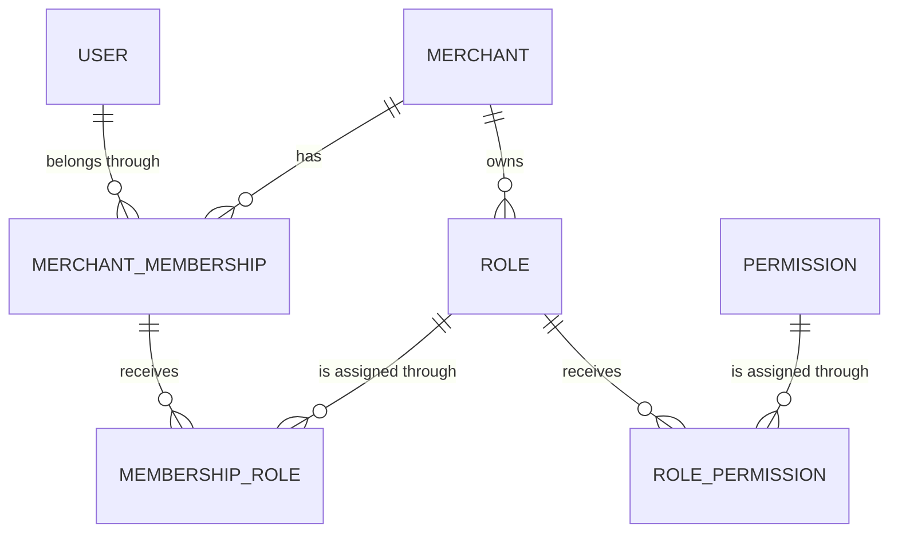

# Authorization Model

## Purpose and boundary

B1.3 establishes Tteeka's merchant-scoped role-based authorization persistence foundation. B1.8 resolves effective context, B1.9 enforces declarative requirements, and B2.1 introduces the first Permission-protected Merchant business routes. Role-management APIs and authorization seeding still do not exist.

`User` remains the global human identity. `MerchantMembership` remains the boundary that says a User belongs to a Merchant. Authorization attaches to that membership rather than directly to User, so one person can have different responsibilities at different merchants.

## Conceptual model



A Membership may receive multiple Roles, and a Role may be assigned to multiple Memberships. A Role may receive multiple Permissions, and one global Permission may be used by Roles belonging to many Merchants. Roles with the same name may exist in separate Merchants.

The authorization path is:

```text
User
  -> MerchantMembership
  -> MembershipRole
  -> Role
  -> RolePermission
  -> Permission
```

## Permission

`Permission` is the global, stable capability vocabulary. It is intentionally not owned by a Merchant.

| Prisma field  | PostgreSQL column | Contract                                                    |
| ------------- | ----------------- | ----------------------------------------------------------- |
| `id`          | `id`              | UUID primary key, generated by PostgreSQL `uuidv7()`        |
| `key`         | `key`             | Required globally unique machine identifier, `varchar(120)` |
| `description` | `description`     | Optional explanatory metadata, `varchar(320)`               |
| `status`      | `status`          | `ACTIVE` or `DEPRECATED`; default `ACTIVE`                  |
| `createdAt`   | `created_at`      | `timestamptz(3)`, default current time                      |
| `updatedAt`   | `updated_at`      | `timestamptz(3)`, maintained by Prisma                      |

Future Permission keys must be canonical lowercase, stable, machine-readable, and dot-delimited, such as the conceptual form `order.read`. B1.3 adds no key validator, regex constraint, or Permission records.

Deprecation preserves a Permission and its existing RolePermission rows for historical addressability. Deleting a referenced Permission is restricted so a hard delete cannot silently change authorization configuration.

## Role

`Role` belongs to exactly one Merchant.

| Prisma field  | PostgreSQL column | Contract                                             |
| ------------- | ----------------- | ---------------------------------------------------- |
| `id`          | `id`              | UUID primary key, generated by PostgreSQL `uuidv7()` |
| `merchantId`  | `merchant_id`     | Required UUID foreign key to `merchants.id`          |
| `name`        | `name`            | Required merchant-local name, `varchar(80)`          |
| `description` | `description`     | Optional explanatory metadata, `varchar(320)`        |
| `status`      | `status`          | `ACTIVE` or `DISABLED`; default `ACTIVE`             |
| `createdAt`   | `created_at`      | `timestamptz(3)`, default current time               |
| `updatedAt`   | `updated_at`      | `timestamptz(3)`, maintained by Prisma               |

`roles_merchant_id_name_key` makes names unique inside one Merchant while allowing the same name in different Merchants. `roles_merchant_id_id_key` exposes the tenant-and-Role composite key used by tenant-safe foreign keys; the UUID `id` remains the primary Role identifier.

Disabling a Role preserves its MembershipRole and RolePermission rows. A Role restricts Merchant deletion. If a Role is legitimately physically deleted, its dependent assignment rows cascade because they must not remain orphaned.

## MembershipRole

`MembershipRole` explicitly assigns one merchant-scoped Role to one MerchantMembership. It is an immutable link: create or delete the assignment rather than changing it into a different assignment.

| Prisma field   | PostgreSQL column | Contract                                             |
| -------------- | ----------------- | ---------------------------------------------------- |
| `id`           | `id`              | UUID primary key, generated by PostgreSQL `uuidv7()` |
| `merchantId`   | `merchant_id`     | Required tenant ownership component                  |
| `membershipId` | `membership_id`   | Required MerchantMembership component                |
| `roleId`       | `role_id`         | Required Role component                              |
| `createdAt`    | `created_at`      | `timestamptz(3)`, default current time               |

`membership_roles_membership_id_role_id_key` prevents assigning the same Role twice to one Membership. There is no `updatedAt` because assignments are immutable relationship facts.

## RolePermission

`RolePermission` explicitly assigns one global Permission to one merchant-scoped Role. It is also an immutable link.

| Prisma field   | PostgreSQL column | Contract                                             |
| -------------- | ----------------- | ---------------------------------------------------- |
| `id`           | `id`              | UUID primary key, generated by PostgreSQL `uuidv7()` |
| `merchantId`   | `merchant_id`     | Required tenant ownership component                  |
| `roleId`       | `role_id`         | Required Role component                              |
| `permissionId` | `permission_id`   | Required global Permission foreign key               |
| `createdAt`    | `created_at`      | `timestamptz(3)`, default current time               |

`role_permissions_role_id_permission_id_key` prevents assigning the same Permission twice to one Role. One Permission can still be used by Roles in different Merchants.

## Database-enforced tenant boundary

Authorization link records carry `merchant_id` deliberately. It is not merely duplicated query metadata: it participates in composite foreign keys that force all tenant-owned components to agree.

`MerchantMembership` and `Role` expose supporting unique keys on `(merchant_id, id)`. PostgreSQL then enforces:

```text
membership_roles (merchant_id, membership_id)
  -> merchant_memberships (merchant_id, id)

membership_roles (merchant_id, role_id)
  -> roles (merchant_id, id)

role_permissions (merchant_id, role_id)
  -> roles (merchant_id, id)
```

Independent foreign keys on only `membership_id` and `role_id` would permit a future application bug to combine a Membership from Merchant A with a Role from Merchant B. The composite design makes PostgreSQL reject that write even when it is attempted with direct SQL. Permission remains a global direct relation through `permission_id`.

## Deletion and lifecycle semantics

- Role to Merchant uses `ON DELETE RESTRICT` and `ON UPDATE CASCADE`.
- MembershipRole to MerchantMembership and Role uses `ON DELETE CASCADE` and `ON UPDATE CASCADE`.
- RolePermission to Role uses `ON DELETE CASCADE` and `ON UPDATE CASCADE`.
- RolePermission to Permission uses `ON DELETE RESTRICT` and `ON UPDATE CASCADE`.
- Normal Role and Permission lifecycle uses `DISABLED` and `DEPRECATED`, preserving assignment rows.
- Cascades apply only when an owning Role or Membership is legitimately physically removed; they do not make hard deletion the normal lifecycle operation.

## B1.8 context resolution

`GET /api/v1/merchants/:merchantId/context` resolves the authorization path with one focused lookup scoped by authenticated User and requested Merchant. Both Merchant and MerchantMembership must be ACTIVE. Zero Roles and zero-Permission Roles are valid; only ACTIVE Roles and ACTIVE Permissions contribute, Permission keys are unioned and deduplicated, and output ordering is deterministic.

The resolved authorization data lives at `request.merchantContext`, separately from global identity at `request.auth`. PostgreSQL is consulted on every context request, so no Session or Redis cache can preserve stale authorization after a lifecycle change. `PermissionEvaluator` implements only exact, case-sensitive membership checks; it gives Role names no authority and implements neither wildcards nor denies. See [MERCHANT_CONTEXT.md](MERCHANT_CONTEXT.md).

B1.9 completes the execution chain now consumed by B2.1 Merchant routes:

```text
User -> MerchantMembership -> MembershipRole -> Role
     -> RolePermission -> Permission -> ResolvedMerchantContext
     -> PermissionEvaluator -> PermissionGuard
```

`@RequirePermission` declares one exact key, and route-scoped `PermissionGuard` evaluates it against the already-resolved context. The guard performs no persistence lookup and Role names still provide no authority or bypass. See [PERMISSION_ENFORCEMENT.md](PERMISSION_ENFORCEMENT.md).

## Intentional omissions and future direction

No Role or Permission relation lives directly on `User`, and `MerchantMembership` has no single `roleId`: those designs would violate merchant context or the multiple-role requirement. No `isOwner`, `isAdmin`, `isManager`, or similar authorization boolean exists.

B1.3 seeds neither default Roles nor a Permission catalog. B2.1 defines the first Merchant business keys. B2.2 adds a code-owned eight-key application catalog and explicit synchronization command without startup side effects or default Roles.

B2.2's separate `AccessManagementModule` administers `MerchantMembership`, `MembershipRole`, `Role`, and `RolePermission` through tenant-scoped APIs. `AuthorizationModule` remains responsible only for resolving and enforcing current state. Permission records remain application-catalog controlled: the API lists assignable ACTIVE catalog entries but exposes no Permission CRUD. Membership and Role lifecycle changes retain join links, exact-set replacements are transactional, and PostgreSQL makes each change visible on the next request without Session revocation. See [STAFF_ROLE_ADMINISTRATION.md](STAFF_ROLE_ADMINISTRATION.md).
